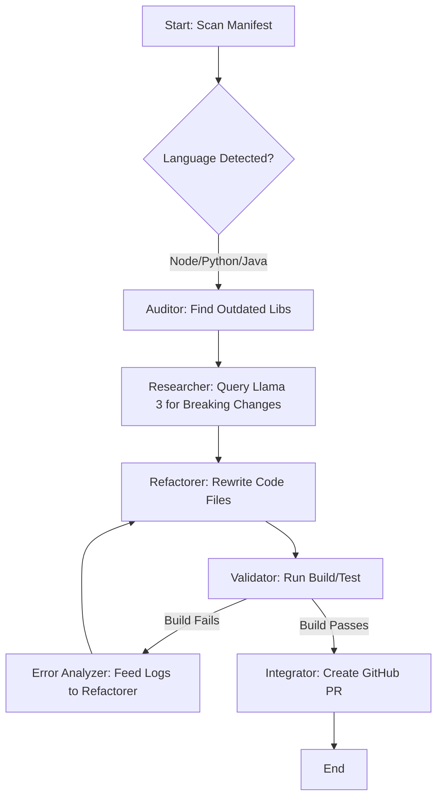

# Upgrade-Pilot: Agentic AI-Driven Legacy Migrator

**Upgrade-Pilot** is an intelligent, multi-language AI agent designed to automate the painful process of legacy codebase migrations. Unlike standard version bumpers, Upgrade-Pilot researches breaking changes, refactors code syntax, and self-heals build errors using a cyclic agentic workflow.

## 🚀 Problem
Standard tools like Dependabot only update version numbers. They do not handle breaking changes, leaving developers to manually fix failing builds in large legacy repositories.

## 💡 Solution
Using **LangGraph** and **Llama 3 (Local)**, Upgrade-Pilot creates a self-healing loop that:
- Detects outdated dependencies.
- Researches migration guides.
- Refactors code to match new APIs.
- Validates fixes via local build/test commands.
- Iterates automatically if the build fails.

## 🛠 Architecture
The tool operates on a directed cyclic graph (agentic workflow):



## 🌍 Supported Tech Stacks
Upgrade-Pilot is built with a **Strategy Pattern**, making it polyglot-ready:
- **Node.js:** `package.json` (npm/yarn)
- **Python:** `requirements.txt` / `pyproject.toml`
- **Java:** `pom.xml` (Maven) / `build.gradle` (Gradle)
- **Go:** `go.mod`
- **Mobile:** Cordova & React Native Bridge updates
- **Legacy:** PHP (Composer) & .NET (`*.csproj`)

## ⚙️ Setup & Installation

### Prerequisites
1. Install **Ollama**: [https://ollama.com/](https://ollama.com/) and run `ollama run llama3`
2. Python 3.10+
3. GitHub PAT with `repo` permissions

### Installation
```bash
git clone https://github.com/your-username/upgrade-pilot.git
cd upgrade-pilot
pip install langchain langgraph langchain_community pygithub streamlit
export GITHUB_TOKEN=your_github_pat_here
export OLLAMA_BASE_URL=http://localhost:11434
```

## 🔒 Enterprise Security & Privacy
- **Local inference:** This POC uses **Llama 3 via Ollama** running on the local machine. Proprietary source code is **never** sent to external cloud LLM providers.
- **Human-in-the-loop:** The tool creates a pull request for human review rather than pushing directly to the main branch.

## 📁 Project Structure
- `app.py`: Streamlit user interface
- `agents/`: LangGraph node definitions (Auditor, Refactorer, etc.)
- `config/`: `LANGUAGE_CONFIG` and build strategies
- `utils/`: GitHub API wrappers and file system helpers
